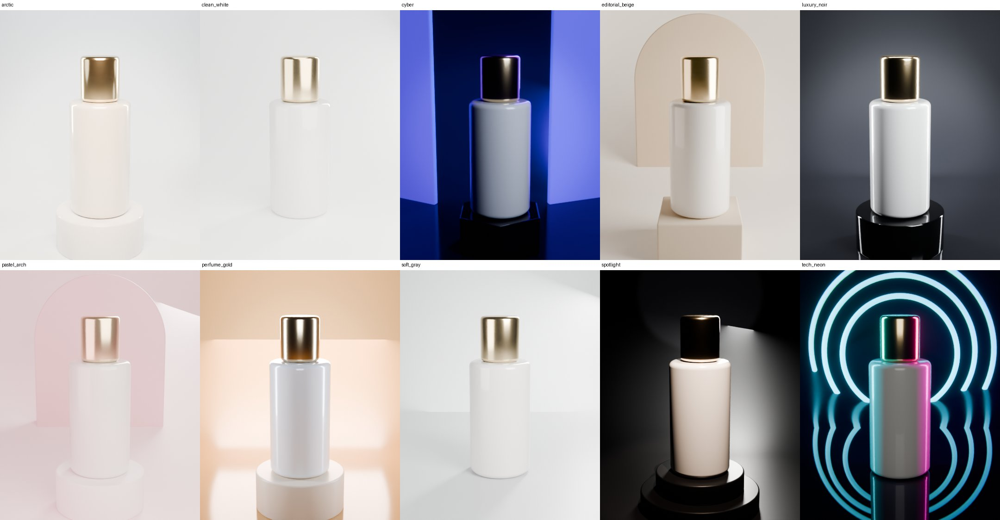

# Lumina Product Studio for Blender

Lumina Product Studio is a Blender add-on for product photography and product motion. Select a product, pick a style and press **Create Studio**. It builds the camera, lighting, backdrop, podium, set dressing, colour grade and output format in one step. Every setting then updates live.



*Ten of the 15 built-in styles on one test bottle (Cycles, 48 samples, no manual tweaks).*

- **Blender:** 4.2 LTS → 5.x. Tested headless on 4.2.23 LTS and 5.2.2 LTS.
- **Licence:** GPL-3.0-or-later.
- **Where to find it:** 3D Viewport → Sidebar (`N`) → **Lumina** tab. There is also a pie menu on `Shift + Alt + L`.

---

## Install

1. Zip the `lumina_product_studio` folder. `blender_manifest.toml` must sit at the root of the zip.
2. In Blender, go to **Edit → Preferences → Get Extensions → ⌄ → Install from Disk…** and choose the zip.
3. Open the **Lumina** tab in the 3D Viewport sidebar.

## 30-second workflow

1. Select your product. Child objects are included automatically.
2. Choose a **Style**, for example *Luxury Noir*, *Pastel Arch* or *Tech Neon*.
3. Press **Create Studio**. The viewport switches to the camera view.
4. Refine the result using the tabs: Camera · Light · Set · Motion · Look · Output.
5. Render one image, a video, **every social format in one click**, or a **360° spin set**.

---

## What's inside

| Area | Highlights |
|---|---|
| **Styles** | 15 one-click art directions that set lighting, backdrop, stage, set dressing and grade together. You can **save your own styles** as JSON to reuse on any product or share with a team. |
| **Camera** | 11 shots. Framing is solved exactly against the product's bounding box: a **Fill %** setting (above 100 % crops in for macro shots), copy-space placement (Left / Right / Top / Bottom) using lens shift, orthographic catalogue mode, Dutch roll, and depth of field with a movable focus target. The camera never goes below the floor. |
| **Lighting** | 35 rigs in 8 categories: essentials, beauty, glass and liquids (dark-field, bright-field, prism dispersion), metal, jewellery, dark and dramatic, tech and colour, natural light. All rigs are **camera-relative**, so they look the same from any shot. Global controls: Power, Softness, Contrast (key:fill), Rim, Warmth (Kelvin), Distance, Rotate Rig. Also Accent A/B colours and a **Light Mixer** that shows every light with its power, colour and visibility. |
| **Backdrop light** | 7 wall treatments (halo, spot pool, top fade, side washes, duo-tone). They use light linking so they never spill onto the product. |
| **World** | Rig ambient, a custom colour, or Blender's **built-in HDRIs** for real-world reflections. You can hide the HDRI from the camera. |
| **Set** | Infinity cove, **360 dome** (clean from every angle, made for orbits), corner, endless floor, and **shadow catcher** (transparent PNG with real shadows). The gradient can be solid, linear or spotlight, and the full multi-stop colour ramp is editable. Floor finish (matte → mirror) with a matte-wall option. Self Glow is **camera-only**, so a bright backdrop never washes out the product. |
| **Stage & dressing** | 5 podiums (round plinth, two-tier, block, hexagon, wide disc) with 5 finishes including metal and glass. 6 set-dressing kits (arch, neon halo rings, floating orbs, pillars, blocks, panels) with a variation seed. |
| **Motion** | **64 product motions** in 7 categories, each with a motion guide. **21 are seamless loops** that line up exactly when the timeline repeats. Directions are camera-relative, so *Slide In from Left* always starts at the left of the frame. Includes squash and stretch, beat-synced bounce/pulse, a step-turn feature showcase, and more. Reverse turns any entrance into an exit. |
| **Camera moves** | 26 moves: push, pull, truck, pedestal, crane, arcs, reveals, orbits 90/180/360, spiral-in, top-down reveal, dolly-zoom (Vertigo), whip, floating cam. Plus an optional **handheld shake** layer. |
| **Look** | 13 grades built on AgX / Khronos PBR Neutral, exposure, gamma and white balance. Optional **Lens FX** in the compositor: bloom, vignette, chromatic aberration, saturation and contrast. FX are skipped automatically if the scene already has its own compositor setup. |
| **Output** | 15 platform formats (Story/Reel, 4:5 feed, square, Pinterest, marketplace 2000 px, web banner, 4K, Scope, A4…), resolution scale, EEVEE/Cycles quality presets, transparent background and motion blur. **Batch render every format**, with the camera reframing for each aspect ratio. **360° spin-set rendering** for web product viewers. |

---

## How it compares to *Cinematic Product Studio* v1.0.33

Lumina is a new add-on written from scratch. No code was copied from the original. It covers the same goals and changes the parts that caused bugs or friction in v1.

| | Cinematic Product Studio v1.0.33 | Lumina Product Studio |
|---|---|---|
| Code base | One 9,935-line `__init__.py` with ~45 lighting rigs hard-coded as `if/elif` branches | Modular package. Rigs, motions, shots, grades and styles are plain data tables, so adding one is a single entry |
| Settings | Around 120 loose `Scene.pas_*` properties | One `scene.lumina` property group |
| Blender 5.x | Uses the 4.x compositor API (`scene.node_tree`, Composite node) | Supports both the 4.x and 5.x compositor APIs, plus layered (slotted) actions |
| Product animation | Moves the product itself, with pivot attach/detach logic | Bakes onto a separate **Motion Rig**. The product's own transforms and keys are never changed, and removing the motion restores them exactly |
| Directions | World-axis based ("Left", "Forward"…) | **Screen-relative** for every shot |
| Loops | Not guaranteed | 21 motions are mathematically seamless, and *Fit Timeline* drops the duplicate frame |
| Framing | Iterative fit with a padding % | Exact solve with **Fill %**, copy-space placement, ortho mode and floor clamping |
| Backdrop gradient | Several releases spent fixing ramp and material-assignment bugs | One generated material on a UV layout designed for gradients. Quick colours and the multi-stop ramp stay in sync, and the ramp survives rebuilds |
| Backdrop glow | Emission lights the whole scene | Glow is visible to the camera only |
| Styles / presets | None | 15 built-in styles plus user styles saved to disk |
| Batch output | 4 aspect ratios, one at a time | 15 formats with **one-click batch rendering** and 360° spin sets |
| Set dressing | 6 shape sets | 6 kits plus 5 stages with finishes |
| Light control | Master power and colour | Power, Softness, Contrast, Rim, Warmth, Distance and Rotate, plus a Light Mixer and accent colours |

## Project layout

```
lumina_product_studio/
  blender_manifest.toml   extension manifest
  __init__.py             registration + pie-menu keymap
  props.py                scene.lumina settings and live-update callbacks
  operators.py            Create Studio, styles, motion, batch / spin rendering
  ui.py                   tabbed sidebar panel + pie menu
  studio.py               orchestration, built-in styles, user style files
  product.py              product selection and measurement
  camera.py               camera rig and exact framing solver
  lighting.py             rigs, backdrop lights, world / HDRI
  backdrop.py             cove, dome, floor, catcher, stage, set dressing
  motion.py               non-destructive motion rig, camera moves, spin sets
  grade.py                colour management + compositor FX (4.x and 5.x)
  output.py               formats and render quality
  data_*.py               preset libraries (pure data)
  utils.py                helpers: tagging, bounds, colour, easing, baking
```

All generated objects go in a **Lumina Studio** collection and are tagged. **Remove Studio** deletes them, restores the previous camera, world and compositor, and leaves the product exactly as it was.
